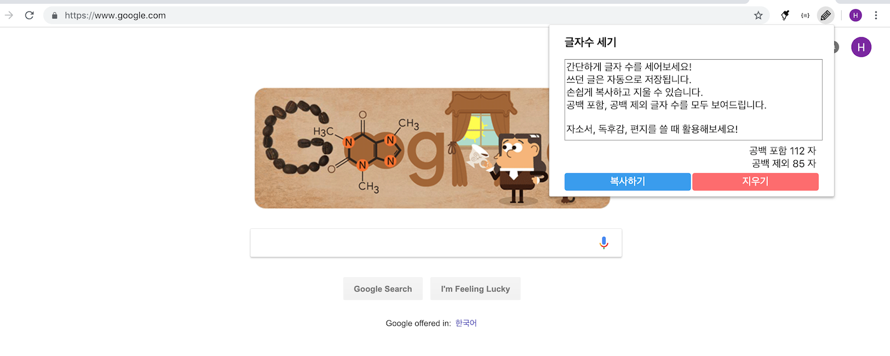

# 한국어 글자수 세기 - 크롬 확장 프로그램
간편하게 한글 글자수를 셀 수 있습니다!
- 공백 포함 / 제외 글자 수 세기
- 복사하기, 지우기
- 자동 저장

# 설치
[크롬 웹 스토어](https://chrome.google.com/webstore/detail/%ED%95%9C%EA%B5%AD%EC%96%B4-%EA%B8%80%EC%9E%90%EC%88%98-%EC%84%B8%EA%B8%B0/hgnnllcclhhigideaknjkbbmnokfocgd?hl=ko) 에서 설치할 수 있습니다.

# Credits
- Icon made by [Silviu Runceanu](https://www.flaticon.com/authors/silviu-runceanu) from [Flaticon](https://www.flaticon.com)
- Thanks to @tobark
